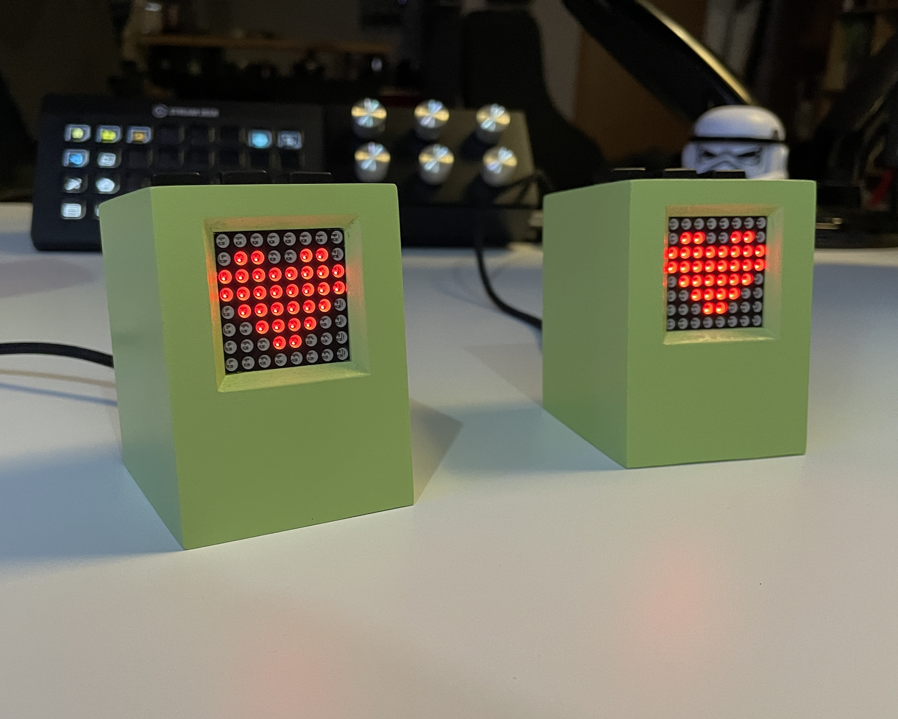
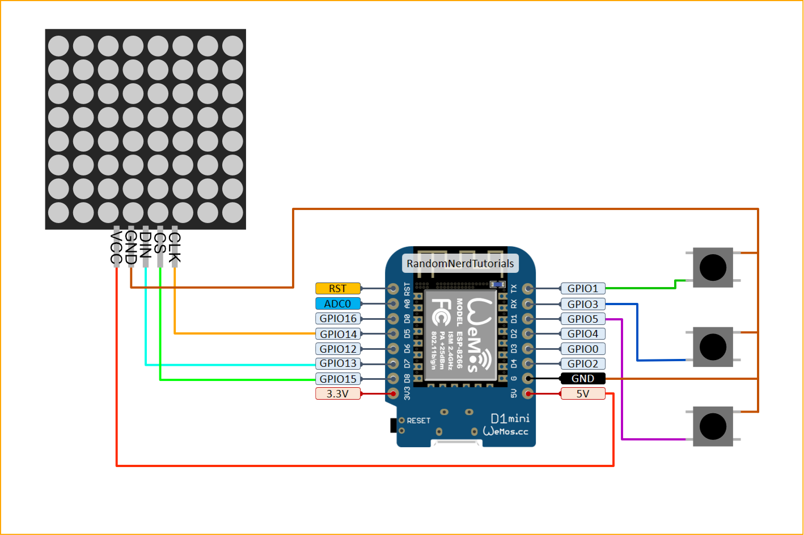

# Mini-PC

The idea behind this project was to build a novelty item that can sit on one's desk and can be used to exchange simple messages with the other device. This works as a kind of mood-display in with an old-school/retro look.
To limit the strain on the microcontroller the network-connection is currently hardcoded,but this could be replaced with a captive portal quite easily.

## Hardware

The following components are needed for the project:

- 1 Wemos D1 Mini (ESP8266)
- 1 8x8 Pixel Matrix (MAX7219)
- 3 12x12 Buttons
- 3D printed housing and bottom-plate

The wiring is done as shown in the included circut diagram.

## Code

The communication works with MQTT, which means a broker is necessary to exchange messages. The parameters for that have to be changed in the code at the specified lines at the top.
